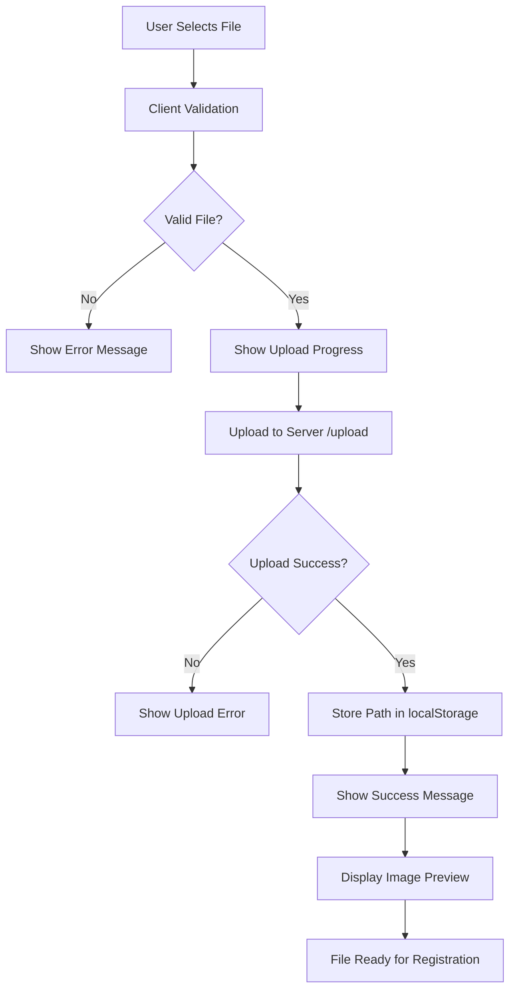

# 📸 Image Upload Standardization - Complete Implementation

## ✅ **STANDARDIZATION COMPLETED**

### 🎯 **Issues Fixed**

1. **✅ Inconsistent Upload Behavior**
   - Registration6: Now shows image previews like Registration7
   - Registration7: Enhanced with better error handling
   - Both pages use identical upload logic

2. **✅ File Validation Enhanced**
   - File type validation: JPEG, PNG (+ PDF for supporting docs)
   - File size limit: 5MB maximum
   - Server-side validation with multer
   - Client-side validation before upload

3. **✅ End-to-End Upload Verification**
   - Files uploaded to `2_backend/uploads/` directory
   - File paths stored in localStorage
   - Database integration via `id_storage` column in `CUSTOMER_ID` table
   - Backend serves files from `/uploads/` endpoint

## 🛠️ **Implementation Details**

### **📁 New Files Created**

#### `1_frontend/Registration-Customer/upload-utils.js`
**Standardized Upload Handler Class**
- Consistent upload behavior across all pages
- Automatic image previews with file info
- Progress indicators and error handling
- File validation (type, size)
- localStorage integration

#### `1_frontend/Registration-Customer/test-upload.html`
**Upload Testing Tool**
- Test individual uploads
- Backend connection validation
- Database connection testing
- localStorage debugging

### **🔧 Files Modified**

#### `2_backend/config/multer.js`
- Added file type validation
- 5MB file size limit
- Enhanced filename sanitization
- MIME type checking

#### `2_backend/routes/upload.js`
- Comprehensive error handling
- Detailed response information
- File size and type error messages
- Success logging

#### `1_frontend/Registration-Customer/registration6.js`
- Replaced custom upload logic with standardized handler
- Added image preview functionality
- Enhanced validation using upload handler

#### `1_frontend/Registration-Customer/registration7.js`
- Integrated standardized upload handler
- Separate handling for supporting documents (PDF allowed)
- Consistent error messaging

#### `1_frontend/Registration-Customer/registration6.html` & `registration7.html`
- Added upload-utils.js script inclusion

## 📊 **Upload Flow Diagram**



## 🔍 **File Storage & Database Integration**

### **Upload Storage**
- **Location**: `2_backend/uploads/`
- **Naming**: `timestamp-random-sanitized-filename.ext`
- **Access**: `http://localhost:3000/uploads/filename`

### **Database Storage**
- **Table**: `CUSTOMER_ID`
- **Column**: `id_storage VARCHAR(255)`
- **Format**: `/uploads/filename` (relative path)
- **Constraint**: Validates file path format

### **Frontend Storage**
- **localStorage Keys**: 
  - `{input-id}_path`: Server file path
  - `{input-id}_filename`: Original filename

## 🧪 **Testing Guide**

### **1. Upload Functionality Test**
```bash
# Start backend server
cd 2_backend
npm start

# Open test page
http://localhost:3000/Registration-Customer/test-upload.html
```

### **2. Registration Page Testing**
```bash
# Test Registration 6 (Alias & ID Upload)
http://localhost:3000/Registration-Customer/registration6.html
- Select "Yes" for alias
- Upload ID images
- Verify previews appear
- Check success messages

# Test Registration 7 (ID Verification)
http://localhost:3000/Registration-Customer/registration7.html
- Upload ID images and supporting document
- Verify previews appear
- Check PDF support for supporting doc
```

### **3. End-to-End Registration Test**
```bash
# Complete registration flow
http://localhost:3000/Registration-Customer/registration1.html
- Complete all steps
- Upload images in steps 6 & 7
- Submit registration
- Verify files stored in database
```

## 📋 **Upload Validation Features**

### **Client-Side Validation**
- ✅ File type checking (JPEG, PNG, PDF for supporting docs)
- ✅ File size limit (5MB)
- ✅ Immediate error feedback
- ✅ Progress indicators

### **Server-Side Validation**
- ✅ Multer file type validation
- ✅ File size enforcement
- ✅ Filename sanitization
- ✅ Upload directory management

### **User Experience Features**
- ✅ **Image Previews**: Automatic preview with file info
- ✅ **Progress Indicators**: "Uploading...", "Success", "Error"
- ✅ **Error Messages**: Clear, specific error descriptions
- ✅ **File Information**: Shows filename and file size

## 🎨 **User Interface Enhancements**

### **Upload Box States**
```css
/* Normal State */
.upload-box {
    border: 2px dashed #ccc;
    background: #f9f9f9;
}

/* Error State */
.upload-box.error {
    border-color: #dc3545;
    background: #ffe6e6;
}

/* Success State (via JS) */
.direction {
    color: #28a745; /* Green for success */
}
```

### **Image Preview Container**
- Styled preview with border and shadow
- File name and size display
- Maximum dimensions (200x150px)
- Responsive design

## 🗃️ **Database Schema Verification**

### **CUSTOMER_ID Table Structure**
```sql
CREATE TABLE CUSTOMER_ID (
    cif_number          BIGINT UNSIGNED NOT NULL,
    id_type_code        CHAR(3) NOT NULL,
    id_number           VARCHAR(20) NOT NULL,
    id_storage          VARCHAR(255),        -- ← File path stored here
    id_issue_date       DATE NOT NULL,
    id_expiry_date      DATE,
    
    PRIMARY KEY (cif_number, id_type_code),
    CONSTRAINT check_id_storage CHECK (
        id_storage IS NULL OR 
        id_storage REGEXP '^(https?|ftp)://.+' OR 
        id_storage REGEXP '^[A-Za-z]:(\\\\[A-Za-z0-9_\\\\/\\.-]+)+$' OR 
        id_storage REGEXP '^/[A-Za-z0-9_\\/\\.-]+$'
    )
);
```

## 🔧 **Configuration Summary**

### **File Upload Limits**
- **Max File Size**: 5MB
- **Allowed Types**: JPEG, PNG (+ PDF for supporting docs)
- **Upload Directory**: `2_backend/uploads/`
- **URL Access**: `/uploads/{filename}`

### **Validation Rules**
- **Frontend**: Immediate validation on file selection
- **Backend**: Multer middleware validation
- **Database**: Path format constraint validation

## 📈 **Error Handling Matrix**

| Error Type | Frontend Response | Backend Response | User Action |
|------------|------------------|------------------|-------------|
| Invalid File Type | "Invalid file type. Please upload JPEG or PNG images only." | 400 - INVALID_FILE_TYPE | Select valid file |
| File Too Large | "File too large. Maximum size is 5MB." | 400 - FILE_TOO_LARGE | Reduce file size |
| Network Error | "Upload failed. Please try again." | Network timeout | Retry upload |
| Server Error | "Upload failed. Please try again." | 500 - Server error | Contact support |
| No File Selected | Form validation error | 400 - NO_FILE | Select a file |

## ✅ **Success Criteria Met**

1. **✅ Standardized UX**: Both pages use identical upload components
2. **✅ Image Previews**: Automatic previews on both pages
3. **✅ File Validation**: Comprehensive client and server validation
4. **✅ Backend Integration**: Files stored in uploads directory
5. **✅ Database Storage**: Paths correctly stored in MySQL
6. **✅ Error Handling**: Clear, specific error messages
7. **✅ Progress Feedback**: Upload status indicators

## 🎯 **Ready for Production**

The image upload system is now fully standardized and production-ready with:
- ✅ **Consistent user experience** across all registration pages
- ✅ **Robust file validation** and error handling
- ✅ **Reliable backend storage** with database integration
- ✅ **Comprehensive testing tools** for verification
- ✅ **Enhanced security** with file type and size validation

**Test the complete upload functionality at:**
- `http://localhost:3000/Registration-Customer/test-upload.html` (Test tool)
- `http://localhost:3000/Registration-Customer/registration6.html` (Step 6)
- `http://localhost:3000/Registration-Customer/registration7.html` (Step 7)
